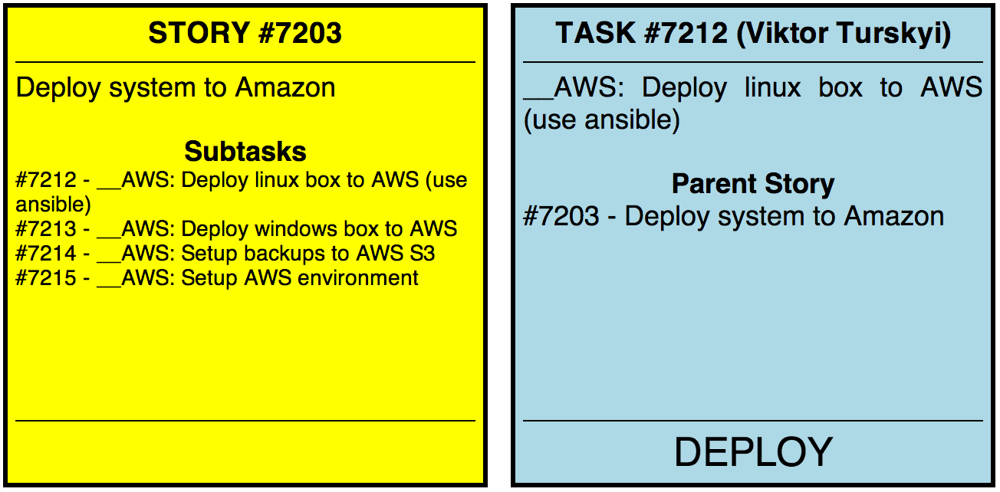

Scrum cards generator
=====================

This tools is for generating printable scrum cards from Redmine. Nothing except browser is required.

# GUIDE

1. Enable REST API with JSONP support
2. Open public/index.html in browser and enter your redmine server url and issues numbers (comma delimited)
3. Enter login and password if required
4. Print and cut cards (to ovoid page breaking inside cards use firefox)

